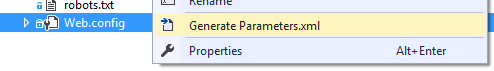
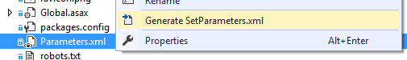
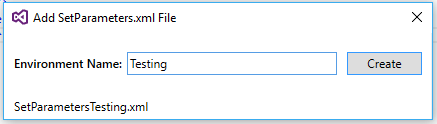
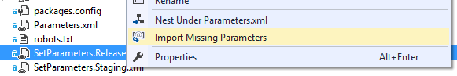
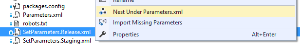

# Web Deploy Parameters Toolkit

<!-- Replace this badge with your own-->

<!-- Update the VS Gallery link after you upload the VSIX-->
Download this extension from the [VS Gallery](https://visualstudiogallery.msdn.microsoft.com/[GuidFromGallery])
or get the [CI build](http://vsixgallery.com/extension/6435437e-72fb-4626-9a47-865f185ce258/).

---------------------------------------

Tools to make it easy to work with parameters in Web Deploy (MSDeploy).

See the [changelog](CHANGELOG.md) for changes and roadmap.

## Features

- Generate Parameters.xml from Web.Config
- Generate SetParameters[Environment].xml
- Import missing parameters into SetParameters.xml files
- Nest SetParameters.xml files under Parameters.xml

### Generate Parameters.xml from Web.Config
Select the web.config in solution explorer and right-click.

Then select *Generate Parameters.xml* to have a Parameters.xml file automatically generated from settings in the web.config file.

### Generate SetParameters[Environment].xml
Select the Parameters.xml file in solution explorer and right-click.

Then select *Generate SetParameters.xml*. 

A dialog will then give you the option to add an environment name to the new SetParameters.xml file to be generated.

Either enter an envionment name or leave it blank and then click *Create*. Then the new SetPameters.xml file is created.

### Import Missing Parameters into SetParameters.xml files
If parameters have been added to the Parameters.xml file, the new parameters can be automatically added to a SetParameters.xml file.  Just select the SetParameters.xml file in solution explorer and right-click.

Then select *Import Missing Parameters* to have any missing parameters automatically added to the selected file.

### Nest SetParameters.xml files under Parameters.xml
SetParameters*.xml files will automatically be nested under the Parameters.xml file. 

To nest a SetParameters*.xml file that was created prior to installing this extension. Select the SetParameters*.xml file in solution explorer and right-click.

Then select *Nest Under Parameters.xml* to have the selected file nested under Parameters.xml.

## Contribute
For cloning and building this project yourself, make sure
to install the
[Extensibility Tools 2015](https://visualstudiogallery.msdn.microsoft.com/ab39a092-1343-46e2-b0f1-6a3f91155aa6)
extension for Visual Studio which enables some features
used by this project.

## License
[Apache 2.0](LICENSE)